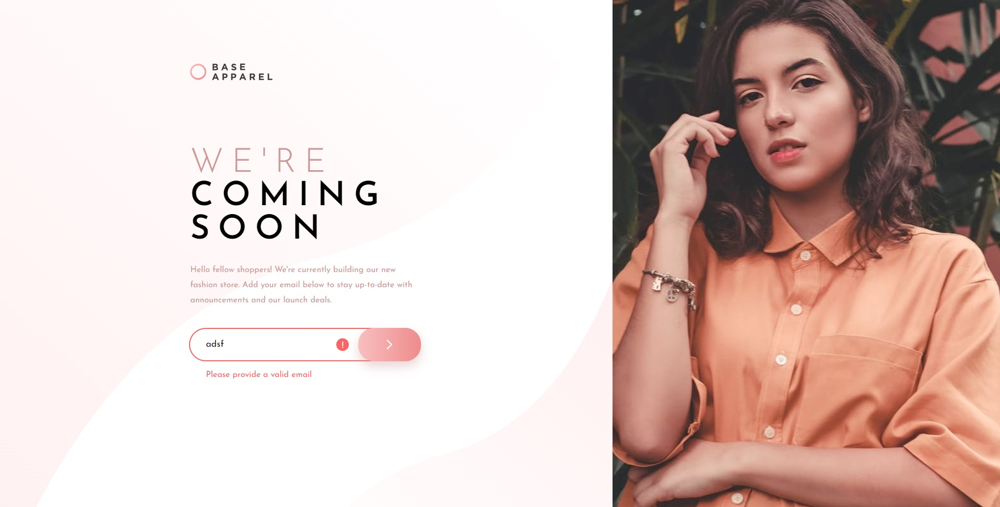

# Frontend Mentor - Base Apparel coming soon page solution

This is a solution to the [Base Apparel coming soon page challenge on Frontend Mentor](https://www.frontendmentor.io/challenges/base-apparel-coming-soon-page-5d46b47f8db8a7063f9331a0). Frontend Mentor challenges help you improve your coding skills by building realistic projects.

## Table of contents

- [Overview](#overview)
  - [The challenge](#the-challenge)
  - [Screenshot](#screenshot)
  - [Links](#links)
- [My process](#my-process)
  - [Built with](#built-with)
  - [What I learned](#what-i-learned)
  - [Continued development](#continued-development)
- [Author](#author)

## Overview

### The challenge

Users should be able to:

- View the optimal layout for the site depending on their device's screen size
- See hover states for all interactive elements on the page
- Receive an error message when the `form` is submitted if:
  - The `input` field is empty
  - The email address is not formatted correctly

### Screenshot

### Links

- Solution URL: [https://github.com/wavegate/base-apparel-coming-soon-master](https://github.com/wavegate/base-apparel-coming-soon-master)
- Live Site URL: [https://playful-begonia-81921f.netlify.app/](https://playful-begonia-81921f.netlify.app/)

## My process

### Built with

- Semantic HTML5 markup
- CSS custom properties
- Flexbox
- JavaScript

### What I learned

- You can use calc to position an absolutely positioned item a certain distance from the end: `left: calc(100% - 100px);`
- You can reverse the ordering of flex.
- SVGs will resize to its parent container if using flex so need to set width/height specifically.
- Simple form validation with regex.

### Continued development

- Regex will likely be an area where I will need to delve in further but I might venture there only when I need it.
- Form validation on the frontend is limited as JavaScript can be disabled, so of course validation must occur on the backend as well.
- I need to familiarize a bit more with positioning images/background images within a container.

## Author

- Website - [wavegate](https://github.com/wavegate)
- Frontend Mentor - [@wavegate](https://www.frontendmentor.io/profile/wavegate)
